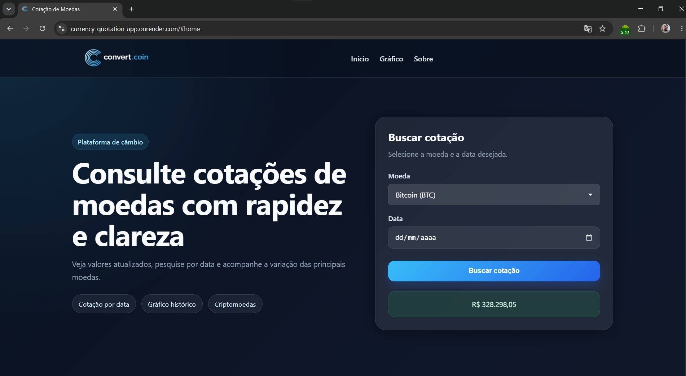
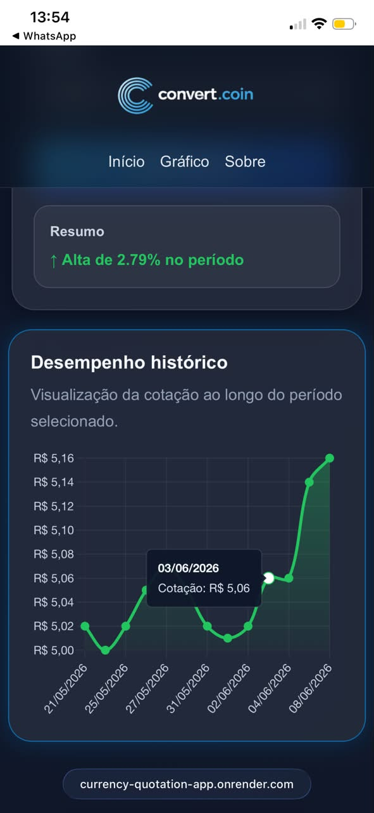

# Currency Quote Tracker

A modern and responsive currency exchange tracking platform built with **Python**, **Flask**, and **JavaScript**.

The application provides real-time exchange rate information for fiat currencies and cryptocurrencies, allowing users to analyze historical price movements through interactive charts and a responsive user interface.

---

## Live Demo

🔗 https://currency-quotation-app.onrender.com/

---

## Screenshots

### Desktop View



### Mobile View



---

## Features

* Real-time exchange rate tracking
* Historical price charts
* Fiat currency support
* Cryptocurrency support
* Interactive data visualization
* Dynamic variation analysis
* Responsive modern interface
* Custom select components
* Smooth hover animations
* Input validation
* Error handling
* API-driven architecture

---

## Supported Currencies

### Fiat Currencies

* USD
* EUR
* GBP
* CAD
* JPY
* CNY

### Cryptocurrencies

* BTC
* ETH
* LTC
* DOGE

---

## Key Technical Features

### API Integration

The application integrates multiple external services:

* Frankfurter API for fiat currencies
* CoinGecko API for cryptocurrencies

### Historical Data Processing

* Historical quote retrieval
* Data normalization
* Timestamp standardization
* Dynamic chart rendering

### Performance Optimization

* In-memory caching system
* Reduced API requests
* Faster response times
* Cached data fallback during API failures

### Error Handling

Protection against:

* Invalid currencies
* Invalid dates
* API connection failures
* Timeout exceptions
* Invalid response formats

### Frontend Enhancements

* Custom Select Component
* Dynamic Chart.js integration
* Lazy-loaded chart rendering
* Hover animations
* Responsive layouts

---

## Architecture

```text
User
 │
 ▼
Flask Application
 │
 ├── routes.py
 │
 ├── services.py
 │
 ▼
External APIs
 ├── Frankfurter API
 └── CoinGecko API
 │
 ▼
Processed Data
 │
 ▼
Chart.js Visualization
 │
 ▼
Responsive User Interface
```

---

## Tech Stack

### Backend

* Python
* Flask
* Requests

### Frontend

* HTML5
* CSS3
* JavaScript

### Data Visualization

* Chart.js

### APIs

* Frankfurter API
* CoinGecko API

---

## Project Structure

```bash
project/
│
├── app/
│   ├── __init__.py
│   ├── routes.py
│   ├── services.py
│   │
│   ├── templates/
│   │   └── index.html
│   │
│   └── static/
│       ├── img/
│       │
│       ├── js/
│       │   ├── chart.js
│       │   ├── custom-select.js
│       │   └── effects.js
│       │
│       ├── style.css
│       └── custom-select.css
│
├── .env
├── .gitignore
├── README.md
├── requirements.txt
└── run.py
```

---

## Backend Overview

### routes.py

Responsible for:

* Route management
* Form processing
* Currency validation
* API endpoint creation
* Historical data delivery

### services.py

Responsible for:

* External API communication
* Cache management
* Data normalization
* Historical data processing
* Timestamp conversion
* Error handling and fallback logic

---

## Frontend Overview

### chart.js

Responsible for:

* Interactive chart rendering
* Historical data visualization
* Dynamic updates
* Currency variation calculation
* Lazy loading implementation

### custom-select.js

Responsible for:

* Custom dropdown behavior
* Enhanced user interaction
* Native select synchronization

### effects.js

Responsible for:

* Hover effects
* Mouse interaction animations
* Glassmorphism visual enhancements

---

## Responsive Design

The interface was designed to provide a seamless experience across different screen sizes:

* Desktop
* Tablets
* Mobile devices

Technologies used:

* CSS Grid
* Flexbox
* Media Queries

---

## APIs Used

### Frankfurter API

Used for fiat currency exchange rates.

https://www.frankfurter.app/

### CoinGecko API

Used for cryptocurrency market data and historical prices.

https://www.coingecko.com/en/api

---

## Installation

Clone the repository:

```bash
git clone https://github.com/gabrielschwanke/currency-quotation-app.git
```

Navigate to the project folder:

```bash
cd currency-quotation-app
```

Install dependencies:

```bash
pip install -r requirements.txt
```

Run the application:

```bash
python run.py
```

Open in your browser:

```text
http://localhost:5000
```

---

## Future Improvements

* User authentication
* Favorite currencies
* Dark/Light theme toggle
* Currency conversion calculator
* More cryptocurrency options
* Real-time updates using WebSockets
* User preferences persistence

---

## License

This project is licensed under the MIT License.

---

## Author

Developed by Gabriel Pereira Schwanke.

GitHub:
https://github.com/gabrielschwanke

LinkedIn:
(Add your LinkedIn profile URL here)
